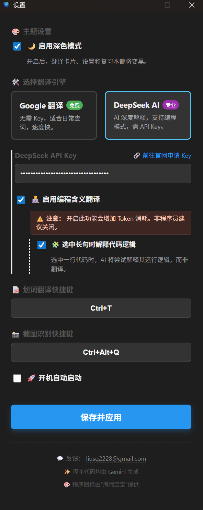
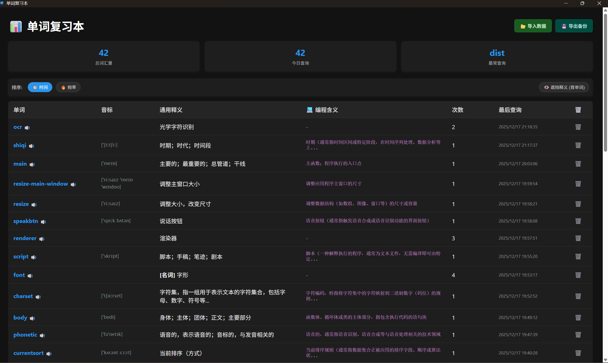

#  DeepSeek 翻译助手 (DeepSeek Translator)


> **“不仅是翻译，更是你的英语学习副驾。”** > 一款基于 Electron + DeepSeek AI 构建的现代化桌面翻译工具，集成了 OCR 截图识别、划词翻译与智能单词复习本。

---

## ✨ 功能亮点 (Features)

### 🧠 双核翻译引擎
- **DeepSeek AI (专业版)**: 支持深度语言理解，特有的 **“编程模式”** 可智能分析代码逻辑，程序员的神器。
- **Google 翻译 (免费版)**: 响应速度快，适合日常快速查词，无需配置 Key。

### 👁️ 智慧之眼 (Smart OCR)
- 基于 **Tesseract.js** 的本地 OCR 引擎。
- 支持 **截图识别**：按下快捷键（默认 `Ctrl+Alt+Q`），框选屏幕任意区域，瞬间提取文字并翻译。
- **离线模型**：内置防丢失机制（路径猎人算法），确保模型文件永不丢失。

### 📊 单词复习本 Pro (Vocabulary Dashboard)
- **自动记录**：查询过的单词自动入库。
- **智能统计**：查看今日查询量、总词汇量及最常查询的单词。
- **艾宾浩斯辅助**：
  - **🕒 时间排序 / 🔥 频率排序**：随心切换。
  - **👁️ 遮挡模式**：一键模糊释义，点击才显示，背单词效率 Max。
  - **🔊 朗读发音**：内置 TTS 语音朗读。
  - **💾 导入/导出**：数据本地备份，安全无忧。

### 🎨 极致 UI 体验
- **无边框设计**：完美圆角，自适应高度，无丑陋滚动条。
- **🌙 深色模式**：全应用适配 Dark Mode，夜间编码不伤眼。
- **交互细节**：点击邮箱自动复制、优雅的 Loading 动画、透明磨砂质感。

---

## 📸 界面预览 (Screenshots)

|                     **设置 (深色模式)**                      |                        **单词复习本**                        |
| :----------------------------------------------------------: | :----------------------------------------------------------: |
|  |  |


---

## 🛠️ 安装与使用 (Installation)

### 方式一：直接下载 (推荐)
前往 [Releases](https://github.com/Never-lose/deepseek-translator/releases) 页面下载最新的 `.exe` 安装包。

### 方式二：开发者构建
如果你想自己修改代码，请按以下步骤操作：

1. **克隆项目**
   ```bash
   git clone [https://github.com/Never-lose/deepseek-translator.git](https://github.com/Never-lose/deepseek-translator.git)
   cd deepseek-translator

1. **安装依赖**

   Bash

   ```
   npm install
   ```

2. **启动开发模式**

   Bash

   ```
   npm start
   ```

3. **打包生成 exe**

   Bash

   ```
   npm run dist
   ```

------

## ⚙️ 快捷键 (Shortcuts)

| **功能**     | **默认快捷键**   | **说明**                     |
| ------------ | ---------------- | ---------------------------- |
| **划词翻译** | `Ctrl + Q`       | 复制文本后按下，自动弹出翻译 |
| **截图识别** | `Ctrl + Alt + Q` | 调起截图工具，框选识别       |

*快捷键可在设置中自定义修改。*

------

## ❤️ 致谢 (Credits)

本项目由以下力量共同驱动：

- ✨ **核心代码生成**: [Google Gemini](https://gemini.google.com/)
- 🎨 **程序图标提供**: "海绵宝宝"

------

## 💬 反馈 (Feedback)

如果遇到 Bug 或有新功能建议，欢迎联系：

📧 Email: liusq2228@gmail.com

------

